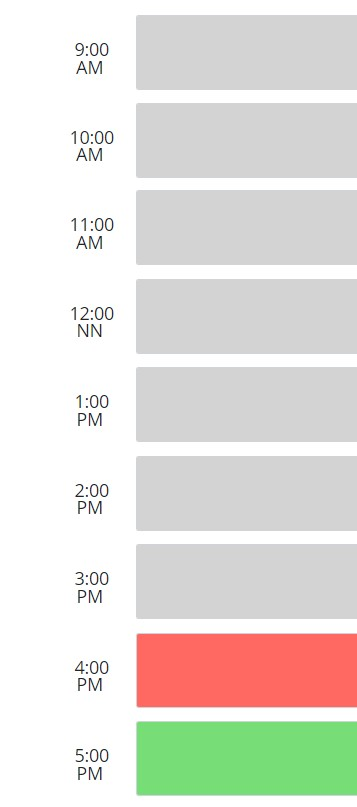

# Changeling005
Changeling - A word of play for 'Challenging'

005 - Natural number following 004 (The previous challenge in this course) 

 ##  Links to Repo and deployment📌

* GitHub Repository link https://github.com/jmdg1023/Changeling005

* Site is live at https://jmdg1023.github.io/Changeling005/

## Learning Resources
* https://www.youtube.com/watch?v=q93hR316nk4

## What this project does 💡💡💡

1. Project is used as adaily planner to note schedule and appointments during working hours 9am to 5pm. The current day will be displayed at the top of the calendar upon reaching the site.

2. When user scrolls down, he is presented with time blocks for standard business hours 9am-5pm.

3. Timeblocks is color coded to indicae whether it is on the past (grey), present(red), or future(green).

4. Click into a time block ro enter an event

5. click on the save button for that time block to save that event is saved in local storage
6.  I refresh the page
THEN the saved events persist